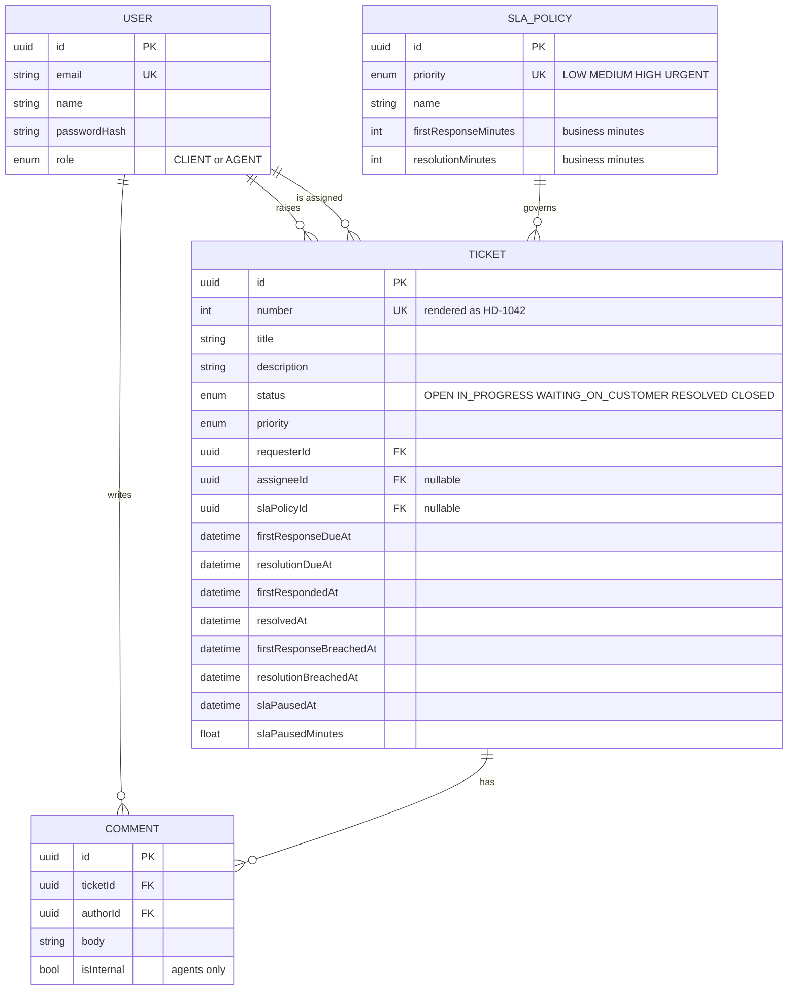

# Helpdesk Ticketing API

A helpdesk backend built around one thing that is genuinely hard: **SLA deadlines that respect business hours**.

I spent a good while maintaining an osTicket installation in PHP. This is the answer to "how would I design that today, from scratch" — a NestJS + PostgreSQL API where the interesting part is not the CRUD but the SLA clock.

- **API docs:** `http://localhost:3000/docs` once running
- **Dashboard:** `http://localhost:3003` — Grafana, provisioned from this repo
- **Stack:** NestJS 11, PostgreSQL 16, Prisma, Redis + BullMQ, JWT auth, Prometheus + Grafana, Jest
- **Frontend:** lives in a separate repository

---

## Why the SLA is the point

Most ticketing side-projects compute a deadline as `createdAt + 4 hours`. That is wrong in a way that matters commercially: a ticket raised at 16:45 on Friday with a 4-hour resolution target is not late at 20:45 on Friday. It is late at **11:45 on Monday**.

So the deadline arithmetic here runs on a business calendar:

| Behaviour | Effect on the clock |
| --- | --- |
| Outside 09:00–17:00 | Does not count |
| Weekend | Does not count |
| Configured public holiday | Does not count |
| Ticket set to `WAITING_ON_CUSTOMER` | Paused |
| Client answers, or an agent moves it on | Resumes, deadline pushed by the business time actually lost |
| Priority changed | Both deadlines recomputed from the new policy, paused time preserved |
| Daylight-saving transition | Handled — all arithmetic is on zoned `DateTime`s, never on raw millisecond offsets |

The whole calculation lives in [`src/sla/business-calendar.ts`](src/sla/business-calendar.ts) as a pure module with no NestJS and no Prisma imports. That is deliberate: it means the tricky logic is testable without a database, and [its unit tests](src/sla/business-calendar.spec.ts) run in milliseconds.

```ts
addBusinessMinutes(new Date('2026-03-06T16:00+01:00'), 180, calendar);
// Friday 16:00 + 3 business hours -> Monday 11:00, not Friday 19:00
```

### Two clocks per ticket

Every ticket carries two independent deadlines, because in practice they fail differently:

- **First response** — stopped by an agent's first *public* comment. An internal note deliberately does not stop it; you cannot satisfy a customer by talking to your colleagues.
- **Resolution** — stopped when the ticket reaches `RESOLVED`.

### Detecting breaches

Deadlines are computed once, at write time, and stored on the ticket row. A repeatable BullMQ job then flags overdue tickets with two indexed `updateMany` calls:

```sql
WHERE status NOT IN ('RESOLVED','CLOSED')
  AND "slaPausedAt" IS NULL
  AND "resolvedAt" IS NULL
  AND "resolutionBreachedAt" IS NULL
  AND "resolutionDueAt" < now()
```

The alternative — recomputing the calendar per row on every scan — would turn a cheap indexed range query into a full scan plus CPU-bound date maths. Denormalising the deadline is what keeps this O(breaches) instead of O(tickets).

One honest trade-off: `resolutionBreachedAt` stores the time the breach was *detected*, not the exact instant it occurred. With a 60-second scan interval those differ by under a minute, and the precise deadline is already on the row as `resolutionDueAt`. Setting each row to its own due date would need a per-row update instead of one statement, which was not worth it.

---

## Observability

`docker compose up` also brings up Prometheus and Grafana, with a dashboard that is provisioned from files in this repository rather than clicked together in the UI.

| | |
| --- | --- |
| Grafana | `http://localhost:3003` — anonymous viewer access, dashboard loads as the home page |
| Prometheus | `http://localhost:9090` |
| Scrape target | `http://api:3000/api/metrics` on the compose network |

### What is measured

| Metric | Type | Where it comes from |
| --- | --- | --- |
| `helpdesk_sla_breaches_total{clock,priority}` | counter | incremented by the breach scanner as it flags tickets |
| `helpdesk_sla_scan_duration_seconds` | histogram | wraps one scan |
| `helpdesk_tickets{status,priority}` | gauge | a `groupBy` run at scrape time |
| `helpdesk_queue_jobs{queue,state}` | gauge | `queue.getJobCounts()` at scrape time |
| `helpdesk_http_duration_seconds{method,route,status}` | histogram | a global interceptor |
| `process_*`, `nodejs_*` | various | `collectDefaultMetrics()` — event loop lag, GC, heap |

Three decisions in there are worth explaining.

**The gauges are filled inside a `collect()` callback**, not on a timer. A gauge refreshed on its own schedule reports whatever it last saw, so the number you read is always a little stale and you cannot tell by how much. Filling it during the scrape means the value is exactly as old as the scrape. The cost is one `groupBy` every 15 seconds, which at this size is nothing; at a size where it stops being nothing, the answer is a summary table, not a faster timer.

**The route label is the Express route template**, `/api/tickets/:id` rather than `/api/tickets/9f3c…`. Labelling with the raw path would mint a new time series per ticket id and eventually take Prometheus down. This is the single easiest way to break a metrics setup and it does not show up until production.

**The breach counter carries a `priority` label**, which is why the scanner issues one statement per priority instead of one overall. The statements are still indexed range queries inside a single transaction, and "which priorities are we failing" is the question a dashboard is actually asked.

The counter counts *newly flagged* breaches, not tickets currently in breach — it never goes down, which is what makes `increase()` and `rate()` meaningful over it. For "how many are broken right now", the ticket gauge answers that.

### Dashboard

Provisioning lives in [`docker/grafana/`](docker/grafana/): the datasource, the dashboard provider, and the dashboard itself as [committed JSON](docker/grafana/dashboards/helpdesk.json). A dashboard built by clicking through the Grafana UI lives in the Grafana volume and disappears with `docker compose down -v`; this one is in git and comes back for anyone who clones the repository.

Panels, in order: breaches per hour by priority, tickets by status, queue depth and failed jobs, p95 request duration by route, and SLA scan duration against Node event loop lag.

---

## Data model



A few decisions worth calling out:

- **One SLA policy per priority**, enforced by a unique constraint. Durations are stored in *business* minutes, so a policy stays readable (`240`) instead of encoding calendar assumptions.
- **`slaPausedMinutes` is a running total**, which is what lets a priority change recompute both deadlines from scratch without silently giving back time the customer already consumed.
- **Deleting a user is restricted** where they authored something and nulls out where they were merely assigned — a helpdesk should not lose its audit trail because someone left the company.

### Status transitions

Transitions go through an explicit table rather than being implied by whatever the API happens to accept ([`ticket-status.ts`](src/tickets/ticket-status.ts)). `CLOSED` is terminal; reopening means going back through `RESOLVED`.

```
OPEN <-> IN_PROGRESS <-> WAITING_ON_CUSTOMER
             |                    |
             +---> RESOLVED <-----+
                       |
                       v
                    CLOSED   (terminal)
```

---

## Roles

Two roles, enforced by a global guard.

| | Client | Agent |
| --- | --- | --- |
| Raise a ticket | yes | yes |
| See tickets | own only | all |
| See internal notes | no | yes |
| Write internal notes | no | yes |
| Change status, priority, assignee | no | yes |
| Dashboard counts | no | yes |

A client requesting someone else's ticket gets `404`, not `403` — a `403` would confirm the ticket exists.

Registration always creates a `CLIENT`; agents are provisioned by the seed. That way the public endpoint cannot be used to mint privileged accounts.

### Tokens

A **15-minute access token** (JWT, sent as `Authorization: Bearer`) plus a **30-day refresh token**.

The refresh token is not a JWT. It is 48 random bytes, and only its SHA-256 hash is stored — a leaked database dump does not hand over live sessions. Every refresh **rotates**: the presented token is revoked and a new one issued.

That rotation buys reuse detection. If a token that has already been spent shows up again, the only two explanations are a stolen token or a broken client, and both mean the session is no longer trustworthy — so every refresh token for that user is revoked and they have to log in again.

The JWT strategy also re-reads the user from the database on every request, so a deleted account stops working immediately instead of at token expiry.

---

## Running it

### Everything in Docker

```bash
cp .env.example .env
docker compose up --build
```

Migrations are applied by the entrypoint and demo data is seeded on first boot. Then open `http://localhost:3000/docs` for the API and `http://localhost:3003` for the dashboard.

Seeded logins (password `password123`):

| Email | Role |
| --- | --- |
| `agent@helpdesk.local` | AGENT |
| `client@helpdesk.local` | CLIENT |

### Local development

Postgres and Redis in Docker, the API on the host with hot reload:

```bash
cp .env.example .env
docker compose up -d postgres redis
npm install
npx prisma migrate deploy
npm run db:seed
npm run start:dev
```

---

## Tests

```bash
npm test          # unit: the SLA calendar
npm run test:e2e  # end to end: needs postgres and redis running
```

`test:e2e` migrates the test database first, so a clean checkout only needs `docker compose up -d postgres redis` before it runs. It targets `TEST_DATABASE_URL`, which the compose stack creates as a separate `helpdesk_test` database — the e2e suite truncates between specs and has no business doing that to your development data.

The split is intentional:

- **Unit tests** cover the business calendar — weekends, holidays, window boundaries, an exactly-consumed day, a 24-hour window, and the March DST transition. No database, no mocks, no Nest test module.
- **e2e tests** cover what only integration can prove: role isolation, transition rules, that an internal note does not stop the first-response clock, that pausing and resuming actually moves the deadline, and that the breach scanner flags a ticket exactly once.

Both run in CI on every push, against real Postgres and Redis service containers, alongside a Docker image build.

---

## Configuration

| Variable | Default | Notes |
| --- | --- | --- |
| `DATABASE_URL` | — | required |
| `REDIS_HOST` / `REDIS_PORT` | `localhost` / `6379` | BullMQ connection |
| `JWT_SECRET` | — | required, min 16 chars |
| `JWT_EXPIRES_IN` | `15m` | access token lifetime |
| `REFRESH_TOKEN_DAYS` | `30` | refresh token lifetime |
| `BUSINESS_TIMEZONE` | `Europe/Belgrade` | any IANA zone |
| `BUSINESS_START_HOUR` / `BUSINESS_END_HOUR` | `9` / `17` | |
| `BUSINESS_WORKDAYS` | `1,2,3,4,5` | ISO weekdays, 1 = Monday |
| `BUSINESS_HOLIDAYS` | empty | comma-separated `YYYY-MM-DD` |
| `SLA_SCAN_INTERVAL_MS` | `60000` | breach scanner interval |
| `TEST_DATABASE_URL` | — | used by the e2e suite instead of `DATABASE_URL` |
| `GRAFANA_ADMIN_PASSWORD` | `admin` | compose only |

Environment is validated with Joi at boot, so a malformed calendar or a short JWT secret fails immediately rather than at the first request.

---

## API

The OpenAPI document is committed as [`openapi.json`](openapi.json) and regenerated with:

```bash
npm run openapi
```

It is checked into the repository on purpose. The frontend generates its TypeScript types from that file rather than from a running server, so a frontend build never depends on the API being up. CI regenerates the spec and fails if it differs from the committed copy — so a DTO cannot change without the contract changing with it.

Browsable docs are at `/docs`. The shape of it:

| Method | Path | |
| --- | --- | --- |
| `POST` | `/api/auth/register` | public |
| `POST` | `/api/auth/login` | public |
| `POST` | `/api/auth/refresh` | public; rotates the refresh token |
| `POST` | `/api/auth/logout` | public; revokes the refresh token |
| `GET` | `/api/auth/me` | |
| `GET` | `/api/tickets` | filter by status, priority, assignee, breached, unassigned, free text; paginated |
| `POST` | `/api/tickets` | stamps the SLA deadlines |
| `GET` | `/api/tickets/:id` | |
| `PATCH` | `/api/tickets/:id` | agent only; moves the SLA clock |
| `GET` | `/api/tickets/stats` | agent only |
| `GET` | `/api/tickets/:id/comments` | internal notes filtered for clients |
| `POST` | `/api/tickets/:id/comments` | |
| `GET` | `/api/users` | agent only |
| `GET` | `/api/health` | public; pings Postgres and Redis |
